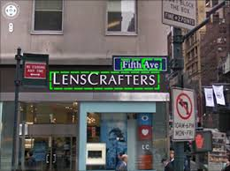

# shinTB

## Abstract

A python package for use [Textboxes : Image Text Detection Model](https://arxiv.org/abs/1611.06779)

implemented by tensorflow, cv2

**Textboxes Paper Review in Korean  (My Blog) : [shinjayne.github.io/textboxes](https://shinjayne.github.io/deeplearning/2017/07/21/text-boxes-paper-review-1.html)**

<hr/>

`shintb` : useable textboxes python package (***Source codes are in here***)

`svt1` : Street view Text dataset. can use with `shintb.svt_data_loader.SVTDataLoader` when training Textboxes model

`config.py` : (NECESSARY) configuration of model building and training with `shinTB`

`main.py` : simple example useage of `shinTB` package

<hr/>



## Dependancies

1. python Version: 3.5.3
2. numpy Version: 1.13.0
3. tensorflow Version: 1.2.1
4. cv2

## How to use

1. Clone this repository to your local.
2. You will use `shintb` python package and `config.py` for building and training your own Textboxes model.
3. `svt1` gives us training / test data.
4. Open new python file.
5. Import `config.config` and `shintb`.
```
from config import config
from shintb import graph_drawer, default_box_control, svt_data_loader, runner
```
6. Initialize `GraphDrawer`,`DefaultBoxControl`,`SVTDataLoader` instance.
 ```
 graphdrawer = graph_drawer.GraphDrawer(config)

 dataloader = svt_data_loader.SVTDataLoader('./svt1/train.xml', './svt1/test.xml')

 dbcontrol = default_box_control.DefaultBoxControl(config, graphdrawer)
 ```
7. `GraphDrawer` instance contains a tensorflow graph of Textboxes.
8.  `DefaultboxControl` instance contains methods and attributes which is related to default box.
9. `SVTDataLoader` instance loads data from `svt1`.

10. Initialize `Runner` instance.
```
runner = runner.Runner(config, graphdrawer, dataloader, dbcontrol)
```
11. `Runner` uses `GraphDrawer`,`DefaultBoxControl`,`SVTDataLoader` instance.
12. If you want to train your Textboxes model, use `Runner.train()`. Every 1000 step, `shintb` will save ckpt file in the directory you set in `config.py`.
```
runner.train()
```
13. If you want to validate/test your model, use `Runner.test()`
```.
runner.test()
```
14. After training, if you want to detect texts from one image use `Runner.image()`.
```
runner.image(<your_image_directory>)
```
